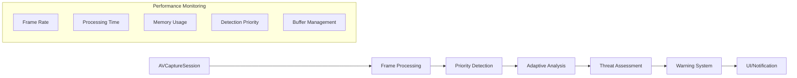
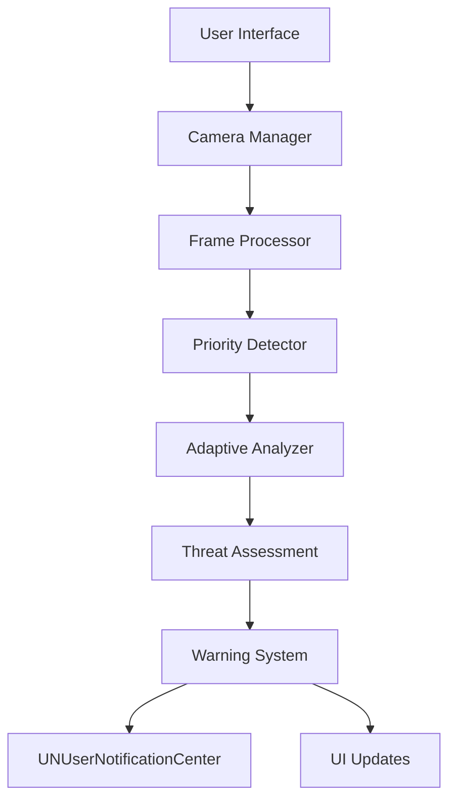

# VOMS (Visual Observation and Monitoring System) - iOS Adaptive


## Overview

VOMS is an advanced personal safety system that utilizes real-time computer vision with adaptive threat detection to detect and assess potential threats. The system processes camera feeds using YOLO object detection combined with priority-based detection and adaptive buffer management to analyze human presence and movement patterns, providing early warnings about potentially threatening approaches.

This documentation specifically covers the iOS implementation of VOMS. For Android implementation, please refer to the Android repository and documentation.

### Platform Support
- iOS: Current repository
- Android: See [VOMS-Android Repository](link-to-android-repo)
- Common Components: Core detection algorithms and threat assessment logic are platform-agnostic

### Cross-Platform Considerations
- Detection models are consistent across platforms
- Threat assessment algorithms maintain parity
- Camera calibration profiles are shared
- Analytics and monitoring are platform-specific

## System Architecture Overview

### High-Level Data Flow


### Component Interaction


## Project Structure
```
VOMS/
├── Application/                     # Application-level components
│   ├── AppDelegate.swift
│   ├── SceneDelegate.swift
│   └── DependencyInjection/        # Dependency injection
│       ├── CameraModule.swift
│       ├── DetectorModule.swift
│       └── AnalyzerModule.swift
│
├── Core/                           # Core functionality
│   ├── Camera/
│   │   ├── Base/
│   │   │   ├── CameraDevice.swift  # Base camera protocol
│   │   │   └── CameraConfig.swift  # Camera configuration
│   │   ├── Hardware/
│   │   │   ├── Phone/             # Phone camera implementation
│   │   │   └── ESP32/             # ESP32 cameras
│   │   │       ├── Base/
│   │   │       └── Models/        # Different ESP32 camera models
│   │   └── Processing/
│   │       ├── FrameProcessor.swift
│   │       └── ImagePool.swift
│   │
│   ├── Detection/
│   │   ├── Adaptive/              # Adaptive detection system
│   │   │   ├── AdaptiveDetectionHistory.swift
│   │   │   ├── PriorityBasedDetector.swift
│   │   │   ├── DetectionPrioritizer.swift
│   │   │   └── SmartHistoryCompressor.swift
│   │   ├── Base/
│   │   │   ├── Detector.swift
│   │   │   └── DetectorConfig.swift
│   │   └── YOLO/
│   │       ├── Base/
│   │       ├── V5/
│   │       └── V8/
│   │
│   ├── Analysis/
│   │   ├── ThreatAnalyzer.swift
│   │   ├── MovementTracker.swift
│   │   ├── ThreatAssessment.swift
│   │   └── Calibration/
│   │
│   ├── Optimization/              # Performance optimization
│   │   ├── DeviceProfiler.swift
│   │   ├── ResourceManager.swift
│   │   └── PerformanceMonitor.swift
│   │
│   └── Warning/
│       ├── WarningSystem.swift
│       ├── Strategy/
│       │   ├── DefaultStrategy.swift
│       │   └── CustomStrategy.swift
│       └── Notification/
│
├── Data/
│   ├── Models/
│   │   ├── Camera/
│   │   ├── Detection/
│   │   └── Analysis/
│   └── Repository/
│
└── Presentation/
    ├── Views/
    └── ViewModels/
```

## Component Details

### 1. Camera System

#### Camera Abstraction
```swift
protocol CameraDevice {
    var capabilities: CameraCapabilities { get }
    var config: CameraConfig { get }
    
    func initialize() async throws
    func startPreview(on layer: AVCaptureVideoPreviewLayer) async throws
    func startAnalysis(analyzer: ImageAnalyzer) async throws
    func stop() async
}

struct CameraCapabilities {
    let maxResolution: CMVideoDimensions
    let supportedResolutions: [CMVideoDimensions]
    let fieldOfView: Float
    let minFps: Int
    let maxFps: Int
}
```

#### Frame Processing with Priority
```swift
class AdaptiveFrameProcessor {
    private let pool: CVPixelBufferPool
    private let detector: PriorityBasedDetector
    private let analyzer: AdaptiveThreatAnalyzer
    
    func processFrame(_ frame: CVPixelBuffer) async throws -> AnalysisResult {
        let prioritizedFrame = await detector.prioritizeFrame(frame)
        return try await analyzer.analyzeFrame(prioritizedFrame)
    }
}

class AdaptiveImagePool {
    private let maxPoolSize: Int
    private let priorityPoolSize: Int
    
    func acquire(width: Int, height: Int, priority: DetectionPriority) -> CVPixelBuffer?
    func release(_ buffer: CVPixelBuffer, priority: DetectionPriority)
}
```

### 2. Enhanced Detection System

#### Adaptive Detection Implementation
```swift
class AdaptiveDetectionHistory {
    private var positions: [DetectionPosition]
    private var threatLevel: ThreatLevel = .normal
    
    static let defaultMaxHistory = 30  // 1 second at 30fps
    static let defaultMinHistory = 10   // Minimum for reliability
    static let criticalThreshold = 0.8  // High threat threshold
    
    func updateThreatLevel(_ newLevel: ThreatLevel) {
        threatLevel = newLevel
        adjustBufferSize()
    }
}

class PriorityBasedDetector {
    private let detectionPool: ConfigurableDetectionPool
    private var histories: [UUID: AdaptiveDetectionHistory]
    
    struct DetectionPriority {
        let proximity: Float      // Distance factor
        let approachSpeed: Float  // Movement speed
        let centralPosition: Float // Position in frame
    }
    
    func detect(_ frame: CVPixelBuffer) async throws -> [Detection] {
        let prioritizedDetections = try await calculatePriorities(frame)
        return try await processDetections(prioritizedDetections)
    }
}
```

### 3. Threat Analysis System

#### Analysis Pipeline with Adaptive Processing
```swift
class AdaptiveThreatAnalyzer {
    private let config: AnalyzerConfig
    private let calibration: CameraCalibration
    private let movementTracker: MovementTracker
    private let deviceProfiler: DeviceProfiler
    
    func analyzeDetections(_ detections: [Detection]) async throws -> ThreatAssessment {
        let deviceProfile = await deviceProfiler.getCurrentProfile()
        
        switch deviceProfile.deviceTier {
        case .high:
            return try await performDetailedAnalysis(detections)
        case .medium:
            return try await performStandardAnalysis(detections)
        case .low:
            return try await performBasicAnalysis(detections)
        }
    }
}

struct ThreatAssessment {
    let level: ThreatLevel
    let confidence: Float
    let details: ThreatDetails
    let priority: DetectionPriority
}
```

### 4. Warning System

#### Adaptive Warning Strategy
```swift
protocol WarningStrategy {
    func calculateWarningLevel(
        assessment: ThreatAssessment,
        context: SecurityContext
    ) -> WarningState
    
    func adjustSensitivity(deviceProfile: DeviceProfile)
}

enum WarningState {
    case normal
    case warning(level: WarningLevel, details: WarningDetails, priority: DetectionPriority)
}
```

## Performance Optimization

### 1. Memory Management
```swift
class MemoryOptimization {
    // Priority-aware buffer pooling
    class AdaptiveBufferPool {
        private let highPriorityPool: CVPixelBufferPool
        private let normalPool: CVPixelBufferPool
        
        func acquire(size: CGSize, priority: DetectionPriority) -> CVPixelBuffer? {
            let pool = priority.proximity > criticalThreshold ? 
                highPriorityPool : normalPool
            return try? pool.createPixelBuffer()
        }
    }
    
    // Object pooling with priority
    class AdaptiveDetectionPool {
        private let criticalPool: ObjectPool<Detection>
        private let normalPool: ObjectPool<Detection>
        
        func acquire(priority: DetectionPriority) -> Detection {
            priority.proximity > criticalThreshold ? 
                criticalPool.acquire() : normalPool.acquire()
        }
    }
}
```

### 2. Device-Specific Optimization
```swift
class DeviceProfiler {
    enum DeviceTier {
        case high   // iPhone 13 Pro and newer
        case medium // iPhone 11 and newer
        case low    // Older devices
    }
    
    struct DeviceProfile {
        let deviceTier: DeviceTier
        let memoryLimit: UInt64
        let processingPower: Float
        let hasNeuralEngine: Bool
        let optimalDetectionConfig: DetectionConfig
    }
    
    func getProfile() -> DeviceProfile {
        // Device profiling implementation
    }
}
```

### 3. Performance Monitoring
```swift
class AdaptivePerformanceProfiler {
    private var metrics: [String: MetricStats]
    private var criticalMetrics: [String: MetricStats]
    
    func startMetric(name: String, priority: DetectionPriority) {
        let timestamp = CACurrentMediaTime()
        let metricsStore = priority.proximity > criticalThreshold ? 
            criticalMetrics : metrics
        metricsStore[name] = MetricStats(startTime: timestamp)
    }
    
    func endMetric(name: String, priority: DetectionPriority) {
        let duration = CACurrentMediaTime() - startTime
        checkThresholds(name, duration, priority)
    }
}
```

## Advanced Features

### 1. Neural Engine Optimization
```swift
class MLOptimizer {
    private let config: MLModelConfiguration
    
    init() {
        config = MLModelConfiguration()
        config.computeUnits = .all
        
        if #available(iOS 16.0, *) {
            config.allowLowPrecisionAccumulationOnGPU = true
        }
    }
    
    func optimizeModel(for priority: DetectionPriority) async throws -> MLModel {
        let configuration = priority.proximity > criticalThreshold ?
            HighPerformanceConfig : BalancedConfig
        return try await MLModel.load(configuration: configuration)
    }
}
```

### 2. Battery Management
```swift
class PowerManager {
    func adjustProcessingLoad(
        thermalState: ProcessInfo.ThermalState,
        batteryState: UIDevice.BatteryState,
        priority: DetectionPriority
    ) -> ProcessingMode {
        switch (thermalState, priority.proximity > criticalThreshold) {
        case (.critical, true):
            return .highPriorityEmergency
        case (.critical, false):
            return .minimal
        case (.serious, true):
            return .highPriorityBalanced
        default:
            return .normal
        }
    }
}
```

## Security and Privacy

### 1. Camera Security
```swift
class CameraSecurityManager {
    private let securityContext = SecurityContext()
    
    func validateAccess(priority: DetectionPriority) -> Bool {
        let securityLevel: SecurityLevel = priority.proximity > criticalThreshold ?
            .critical : .normal
        return securityContext.validateAccess(level: securityLevel)
    }
    
    func secureCameraStream(_ stream: AVCaptureSession) throws -> SecureStream {
        let encryption = priority.proximity > criticalThreshold ?
            .aes256 : .aes128
        return try encryptionManager.secure(stream, using: encryption)
    }
}
```

### 2. Privacy Zones
```swift
class PrivacyManager {
    func applyPrivacyMask(
        frame: CVPixelBuffer,
        zones: [PrivacyZone],
        priority: DetectionPriority
    ) throws -> CVPixelBuffer {
        let maskingQuality: MaskingQuality = priority.proximity > criticalThreshold ?
            .high : .standard
        return try privacyZoneManager.maskFrame(frame, zones, quality: maskingQuality)
    }
}
```

## Device Support Matrix

| Feature | Minimum | Recommended | Optional |
|---------|---------|-------------|-----------|
| iOS Version | 15.0 | 16.0+ | - |
| Processor | A12 | A14+ | - |
| Neural Engine | Yes | Yes | - |
| RAM | 4GB | 6GB+ | - |
| Camera | TrueDepth | Dual/Triple | LiDAR |
| Storage | 200MB | 500MB+ | - |

## Version History

### Current Version
- Version: 0.6.0-beta
- Release Date: 2024-11-11
- Status: Beta Development

### Key Features
- Adaptive threat detection
- Priority-based processing
- Device-specific optimization
- Smart history compression
- Enhanced performance monitoring
- Privacy zone management
- Neural Engine optimization

## Implementation Guidelines

### 1. Core ML Integration
```swift
class MLManager {
    private var model: YOLOModel?
    private let priorityConfig: PriorityMLConfig
    
    func loadModel() async throws {
        let config = MLModelConfiguration()
        config.computeUnits = .all
        
        // Adjust configuration based on device capabilities
        if await DeviceProfiler.shared.supportsANE() {
            config.preferredMetalDevice = MTLCreateSystemDefaultDevice()
        }
        
        model = try await YOLOModel(configuration: config)
    }
    
    func detect(in pixelBuffer: CVPixelBuffer, priority: DetectionPriority) async throws -> [Detection] {
        guard let model = model else { throw MLError.modelNotLoaded }
        
        // Adjust batch size based on priority
        let batchSize = priority.proximity > criticalThreshold ? 1 : 4
        
        let input = try prepareInput(pixelBuffer, batchSize: batchSize)
        return try await performDetection(input, priority: priority)
    }
    
    private func performDetection(_ input: MLFeatureProvider, priority: DetectionPriority) async throws -> [Detection] {
        // Use high-priority queue for critical detections
        let queue = priority.proximity > criticalThreshold ?
            DispatchQueue.global(qos: .userInteractive) :
            DispatchQueue.global(qos: .userInitiated)
        
        return try await withCheckedThrowingContinuation { continuation in
            queue.async {
                do {
                    let result = try self.model?.prediction(from: input)
                    let detections = self.processOutput(result)
                    continuation.resume(returning: detections)
                } catch {
                    continuation.resume(throwing: error)
                }
            }
        }
    }
}
```

### 2. Background Processing
```swift
class BackgroundTaskManager {
    private var backgroundTask: UIBackgroundTaskIdentifier = .invalid
    private let processingQueue: OperationQueue
    
    init() {
        processingQueue = OperationQueue()
        processingQueue.qualityOfService = .userInitiated
    }
    
    func beginBackgroundTask() {
        backgroundTask = UIApplication.shared.beginBackgroundTask { [weak self] in
            self?.endBackgroundTask()
        }
    }
    
    func processInBackground(priority: DetectionPriority) async {
        // Adjust queue priority based on detection priority
        processingQueue.qualityOfService = priority.proximity > criticalThreshold ?
            .userInteractive : .userInitiated
            
        // Create and configure background operation
        let operation = BackgroundDetectionOperation(priority: priority)
        operation.completionBlock = { [weak self] in
            self?.endBackgroundTask()
        }
        
        processingQueue.addOperation(operation)
    }
    
    private func endBackgroundTask() {
        guard backgroundTask != .invalid else { return }
        UIApplication.shared.endBackgroundTask(backgroundTask)
        backgroundTask = .invalid
    }
}

class BackgroundDetectionOperation: Operation {
    private let priority: DetectionPriority
    
    init(priority: DetectionPriority) {
        self.priority = priority
        super.init()
        
        // Configure operation based on priority
        self.queuePriority = priority.proximity > criticalThreshold ?
            .veryHigh : .normal
    }
    
    override func main() {
        // Implement detection logic with priority considerations
    }
}
```

### 3. Metal Performance Optimization
```swift
class MetalPerformanceOptimizer {
    private let device: MTLDevice
    private let commandQueue: MTLCommandQueue
    private var pipelineState: MTLComputePipelineState?
    
    init?(priority: DetectionPriority) throws {
        guard let device = MTLCreateSystemDefaultDevice(),
              let queue = device.makeCommandQueue() else {
            return nil
        }
        
        self.device = device
        self.commandQueue = queue
        try self.setupPipeline(priority: priority)
    }
    
    private func setupPipeline(priority: DetectionPriority) throws {
        // Configure pipeline based on priority
        let functionName = priority.proximity > criticalThreshold ?
            "highPriorityProcessing" : "standardProcessing"
            
        guard let library = device.makeDefaultLibrary(),
              let function = library.makeFunction(name: functionName) else {
            throw MetalError.setupFailed
        }
        
        pipelineState = try device.makeComputePipelineState(function: function)
    }
    
    func processImage(_ pixelBuffer: CVPixelBuffer, priority: DetectionPriority) throws -> CVPixelBuffer {
        let commandBuffer = commandQueue.makeCommandBuffer()
        let encoder = commandBuffer?.makeComputeCommandEncoder()
        
        // Configure processing based on priority
        if priority.proximity > criticalThreshold {
            encoder?.setBytes(&HighPriorityConstants, length: MemoryLayout<Constants>.size, index: 0)
        } else {
            encoder?.setBytes(&StandardConstants, length: MemoryLayout<Constants>.size, index: 0)
        }
        
        // Execute and wait for critical detections
        if priority.proximity > criticalThreshold {
            commandBuffer?.commit()
            commandBuffer?.waitUntilCompleted()
        } else {
            commandBuffer?.commit()
        }
        
        return outputBuffer
    }
}
```

### 4. Testing Strategy
```swift
class AdaptiveDetectionTests: XCTestCase {
    var detector: PriorityBasedDetector!
    
    override func setUp() {
        super.setUp()
        detector = PriorityBasedDetector()
    }
    
    func testPriorityDetection() async throws {
        // Test critical priority detection
        let criticalPriority = DetectionPriority(
            proximity: 0.9,
            approachSpeed: 0.8,
            centralPosition: 0.7
        )
        let criticalResult = try await detector.detect(
            testImage,
            priority: criticalPriority
        )
        
        XCTAssertEqual(criticalResult.processingMode, .highPriority)
        XCTAssertGreaterThan(criticalResult.detailLevel, 0.8)
        
        // Test normal priority detection
        let normalPriority = DetectionPriority(
            proximity: 0.3,
            approachSpeed: 0.2,
            centralPosition: 0.5
        )
        let normalResult = try await detector.detect(
            testImage,
            priority: normalPriority
        )
        
        XCTAssertEqual(normalResult.processingMode, .standard)
    }
    
    func testAdaptivePerformance() async throws {
        measure {
            // Measure critical detection performance
            let criticalMetrics = try await detector.detectWithMetrics(
                testImage,
                priority: highPriority
            )
            XCTAssertLessThan(criticalMetrics.processingTime, 0.1)
            
            // Measure normal detection performance
            let normalMetrics = try await detector.detectWithMetrics(
                testImage,
                priority: normalPriority
            )
            XCTAssertLessThan(normalMetrics.processingTime, 0.2)
        }
    }
}
```

## Performance Monitoring and Analytics

### 1. MetricKit Integration
```swift
class PerformanceMonitor: MXMetricManagerSubscriber {
    private var metrics: [String: MetricAggregator] = [:]
    private var criticalMetrics: [String: MetricAggregator] = [:]
    
    func didReceive(_ payloads: [MXMetricPayload]) {
        payloads.forEach { payload in
            // Process CPU metrics
            if let cpuMetrics = payload.cpuMetrics {
                processCPUMetrics(cpuMetrics)
            }
            
            // Process memory metrics
            if let memoryMetrics = payload.memoryMetrics {
                processMemoryMetrics(memoryMetrics)
            }
            
            // Process disk metrics
            if let diskMetrics = payload.diskMetrics {
                processDiskMetrics(diskMetrics)
            }
        }
    }
    
    func processCPUMetrics(_ metrics: MXCPUMetric) {
        // Process based on priority
        let processingTime = metrics.cumulativeCPUTime
        
        if processingTime > criticalThreshold {
            criticalMetrics["cpu"]?.addValue(processingTime)
        } else {
            metrics["cpu"]?.addValue(processingTime)
        }
    }
}
```

### 2. Firebase Integration
```swift
class AnalyticsManager {
    static let shared = AnalyticsManager()
    
    func logDetectionEvent(
        detectionCount: Int,
        processingTime: TimeInterval,
        confidence: Float,
        priority: DetectionPriority
    ) {
        Analytics.logEvent("detection_complete", parameters: [
            "detection_count": detectionCount,
            "processing_time_ms": Int(processingTime * 1000),
            "confidence_score": confidence,
            "priority_level": priority.description,
            "device_model": UIDevice.current.model,
            "ios_version": UIDevice.current.systemVersion
        ])
    }
    
    func logPerformanceMetrics(
        priority: DetectionPriority,
        metrics: PerformanceMetrics
    ) {
        let trace = Performance.startTrace(name: "detection_performance")
        
        trace?.setMetric(
            metrics.processingTime,
            forName: "processing_time_ms"
        )
        trace?.setAttribute(
            priority.description,
            forName: "priority_level"
        )
        
        trace?.stop()
    }
}
```

### 3. Crash Reporting
```swift
class CrashReporter {
    func logException(
        _ error: Error,
        priority: DetectionPriority
    ) {
        Crashlytics.crashlytics().record(
            error: error,
            userInfo: [
                "priority_level": priority.description,
                "processing_mode": priority.proximity > criticalThreshold ?
                    "critical" : "normal",
                "detection_count": String(describing: detectionCount),
                "processing_time": String(describing: processingTime)
            ]
        )
    }
    
    func monitorErrors() {
        // Setup error monitoring
        let exceptionModel = ExceptionModel(
            name: "VOMs Detection Error",
            reason: "Detection pipeline failure"
        )
        
        Crashlytics.crashlytics().record(
            exceptionModel: exceptionModel
        )
    }
}
```

## Support and Resources

### Documentation
- [API Reference](docs/api-reference.md)
- [Threat Detection Guide](docs/threat-detection-guide.md)
- [Performance Guide](docs/performance-guide.md)
- [Privacy Implementation](docs/privacy-guide.md)

### Community
- [Issue Tracker](https://github.com/username/voms-ios/issues)
- [Discussion Forum](https://github.com/username/voms-ios/discussions)
- [Contributing Guide](CONTRIBUTING.md)
