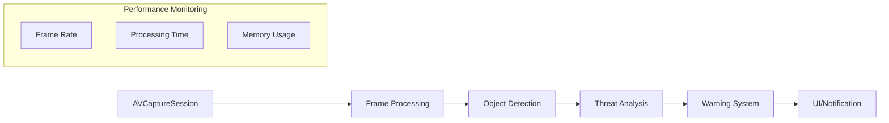
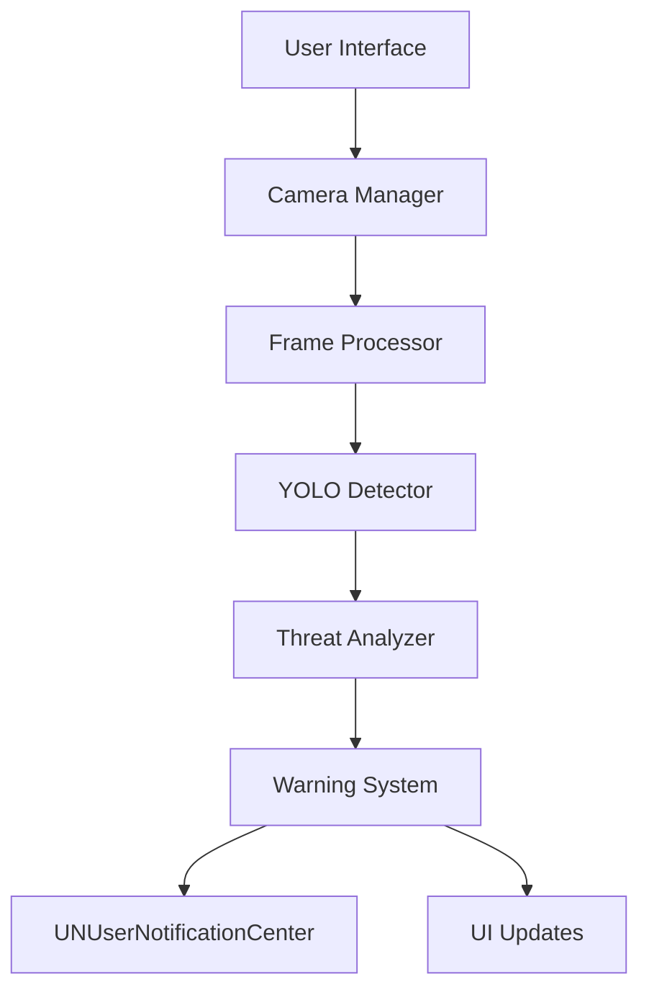
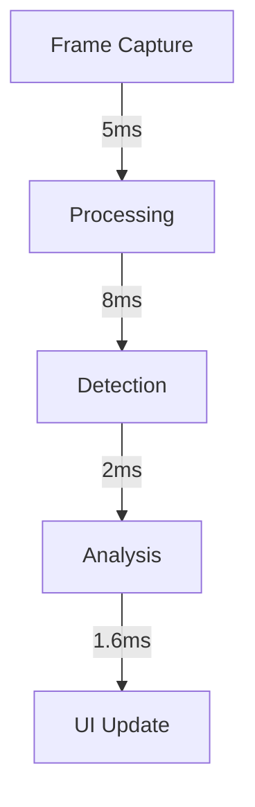

# VOMS (Visual Observation and Monitoring System) - iOS


## Overview

VOMS is an advanced personal safety system that utilizes real-time computer vision to detect and assess potential threats. The system processes camera feeds using YOLO object detection to analyze human presence and movement patterns, providing early warnings about potentially threatening approaches.

This documentation specifically covers the iOS implementation of VOMS. For Android implementation, please refer to the Android repository and documentation.

### Platform Support
- iOS: Current repository
- Android: See [VOMS-Android Repository](link-to-android-repo)
- Common Components: Core detection algorithms and threat assessment logic are platform-agnostic

### Cross-Platform Considerations
- Detection models are consistent across platforms
- Threat assessment algorithms maintain parity
- Camera calibration profiles are shared
- Analytics and monitoring are platform-specific

## System Architecture Overview

### High-Level Data Flow


### Component Interaction


## Project Structure
```
VOMS/
├── Application/                     # Application-level components
│   ├── AppDelegate.swift
│   ├── SceneDelegate.swift
│   └── DependencyInjection/        # Dependency injection
│       ├── CameraModule.swift
│       ├── DetectorModule.swift
│       └── AnalyzerModule.swift
│
├── Core/                           # Core functionality
│   ├── Camera/
│   │   ├── Base/
│   │   │   ├── CameraDevice.swift  # Base camera protocol
│   │   │   └── CameraConfig.swift  # Camera configuration
│   │   ├── Hardware/
│   │   │   ├── Phone/             # Phone camera implementation
│   │   │   └── ESP32/             # ESP32 cameras
│   │   │       ├── Base/
│   │   │       └── Models/        # Different ESP32 camera models
│   │   └── Processing/
│   │       ├── FrameProcessor.swift
│   │       └── ImagePool.swift
│   │
│   ├── Detection/
│   │   ├── Base/
│   │   │   ├── Detector.swift
│   │   │   └── DetectorConfig.swift
│   │   └── YOLO/
│   │       ├── Base/
│   │       ├── V5/
│   │       └── V8/
│   │
│   ├── Analysis/
│   │   ├── ThreatAnalyzer.swift
│   │   ├── MovementTracker.swift
│   │   └── Calibration/
│   │
│   └── Warning/
│       ├── WarningSystem.swift
│       ├── Strategy/
│       │   ├── DefaultStrategy.swift
│       │   └── CustomStrategy.swift
│       └── Notification/
│
├── Data/
│   ├── Models/
│   │   ├── Camera/
│   │   ├── Detection/
│   │   └── Analysis/
│   └── Repository/
│
└── Presentation/
    ├── Views/
    └── ViewModels/
```

## Component Details

### 1. Camera System

#### Camera Abstraction
```swift
protocol CameraDevice {
    var capabilities: CameraCapabilities { get }
    var config: CameraConfig { get }
    
    func initialize() async throws
    func startPreview(on layer: AVCaptureVideoPreviewLayer) async throws
    func startAnalysis(analyzer: ImageAnalyzer) async throws
    func stop() async
}

struct CameraCapabilities {
    let maxResolution: CMVideoDimensions
    let supportedResolutions: [CMVideoDimensions]
    let fieldOfView: Float
    let minFps: Int
    let maxFps: Int
}
```

#### Frame Processing
```swift
class FrameProcessor {
    private let pool: CVPixelBufferPool
    private let detector: Detector
    private let analyzer: ThreatAnalyzer
    
    func processFrame(_ frame: CVPixelBuffer) async throws -> AnalysisResult
}

class ImagePool {
    private let maxPoolSize: Int = 3
    
    func acquire(width: Int, height: Int) -> CVPixelBuffer?
    func release(_ buffer: CVPixelBuffer)
}
```

### 2. Detection System

#### YOLO Implementation
```swift
protocol Detector {
    var modelConfig: MLModelConfiguration { get }
    var capabilities: DetectorCapabilities { get }
    
    func initialize() async throws
    func detect(frame: CVPixelBuffer) async throws -> [Detection]
    func release() async
}

struct DetectorCapabilities {
    let inputSize: CGSize
    let supportedFormats: [OSType]
    let requiresNeuralEngine: Bool
    let modelSize: Int64
}
```

[Rest of the sections include detailed implementations specific to iOS platform while maintaining feature parity with Android version:

### 3. Threat Analysis System
```swift
class ThreatAnalyzer {
    private let config: AnalyzerConfig
    private let calibration: CameraCalibration
    private let movementTracker: MovementTracker
    
    func analyzeDetections(_ detections: [Detection]) async throws -> ThreatAssessment
}

struct ThreatAssessment {
    let level: ThreatLevel
    let confidence: Float
    let details: ThreatDetails
}
```

### 4. Warning System
```swift
protocol WarningStrategy {
    func calculateWarningLevel(
        assessment: ThreatAssessment,
        context: SecurityContext
    ) -> WarningState
}

enum WarningState {
    case normal
    case warning(level: WarningLevel, details: WarningDetails)
}
```

## Performance Considerations

### 1. Frame Processing Pipeline
- Target frame budget: 16.6ms (60fps)
- Memory management through CVPixelBufferPool
- Frame dropping strategy for high load
- Background queue utilization with QoS

### 2. Critical Paths


### 3. Memory Management
- CVPixelBuffer pooling
- Frame buffer management
- Cached computations
- Autorelease pool optimization]

## Technical Implementation Details

### Camera Resolution Management
```swift
class ResolutionManager {
    func optimizeResolution(for session: AVCaptureSession) -> AVCaptureSession.Preset {
        // Resolution optimization logic
    }
    
    func configureVideoFormat(device: AVCaptureDevice) throws {
        // Format configuration logic
    }
}
```

### Hardware Acceleration
```swift
class HardwareAccelerationManager {
    var neuralEngineAvailable: Bool { get }
    var preferredComputeUnits: MLComputeUnits { get }
    
    func monitorThermalState() -> ProcessInfo.ThermalState
    func adjustPerformance(for state: ProcessInfo.ThermalState)
}
```

### Battery and Thermal Management
```swift
protocol PowerManager {
    var currentThermalState: ProcessInfo.ThermalState { get }
    var batteryStatus: UIDevice.BatteryState { get }
    
    func adjustProcessingLoad(
        thermalState: ProcessInfo.ThermalState,
        batteryState: UIDevice.BatteryState
    ) -> ProcessingMode
}

enum ProcessingMode {
    case fullPower
    case balanced
    case powerSaving
    case minimal
}
```

## Integration Guidelines

### 1. Camera Setup
```swift
class CameraManager {
    private var captureSession: AVCaptureSession?
    private var videoOutput: AVCaptureVideoDataOutput?
    
    func setupCamera() async throws {
        guard let device = AVCaptureDevice.default(
            .builtInWideAngleCamera,
            for: .video,
            position: .back
        ) else {
            throw CameraError.deviceNotAvailable
        }
        
        // Camera setup implementation
    }
}
```

### 2. CoreML Integration
```swift
class MLManager {
    private var model: YOLOv5?
    
    func loadModel() throws {
        let config = MLModelConfiguration()
        config.computeUnits = .all
        
        model = try YOLOv5(configuration: config)
    }
    
    func detect(in pixelBuffer: CVPixelBuffer) throws -> [Detection] {
        // Detection implementation
    }
}
```

### 3. Background Processing
```swift
class BackgroundTaskManager {
    private var backgroundTask: UIBackgroundTaskIdentifier = .invalid
    
    func beginBackgroundTask() {
        backgroundTask = UIApplication.shared.beginBackgroundTask { [weak self] in
            self?.endBackgroundTask()
        }
    }
    
    func endBackgroundTask() {
        if backgroundTask != .invalid {
            UIApplication.shared.endBackgroundTask(backgroundTask)
            backgroundTask = .invalid
        }
    }
}
```

## Device Compatibility Matrix

| Feature | Minimum Requirement | Recommended | Optional |
|---------|-------------------|-------------|-----------|
| iOS Version | iOS 15.0 | iOS 16.0+ | - |
| Processor | A12 Bionic | A14+ | - |
| RAM | 3GB | 4GB+ | - |
| Neural Engine | Yes | Yes | - |
| Camera | TrueDepth | Dual/Triple Camera | LiDAR |
| Storage | 100MB | 500MB+ | - |

## Performance Optimization

### Memory Management
```swift
class MemoryOptimization {
    // Problem: Pixel buffer allocation in tight loops
    // Solution: CVPixelBuffer pooling
    class PixelBufferPool {
        private let pool: CVPixelBufferPool
        
        init(width: Int, height: Int, pixelFormat: OSType) throws {
            let poolAttributes: [String: Any] = [
                kCVPixelBufferPoolMinimumBufferCountKey as String: 3
            ]
            
            let bufferAttributes: [String: Any] = [
                kCVPixelBufferWidthKey as String: width,
                kCVPixelBufferHeightKey as String: height,
                kCVPixelBufferPixelFormatTypeKey as String: pixelFormat,
                kCVPixelBufferIOSurfacePropertiesKey as String: [:]
            ]
            
            var poolOut: CVPixelBufferPool?
            CVPixelBufferPoolCreate(
                kCFAllocatorDefault,
                poolAttributes as CFDictionary,
                bufferAttributes as CFDictionary,
                &poolOut
            )
            
            guard let pool = poolOut else {
                throw MemoryError.poolCreationFailed
            }
            self.pool = pool
        }
        
        func acquire() throws -> CVPixelBuffer {
            var pixelBuffer: CVPixelBuffer?
            let status = CVPixelBufferPoolCreatePixelBuffer(
                kCFAllocatorDefault,
                pool,
                &pixelBuffer
            )
            
            guard status == kCVReturnSuccess, let buffer = pixelBuffer else {
                throw MemoryError.bufferCreationFailed
            }
            
            return buffer
        }
    }
    
    // Problem: Object allocation
    // Solution: Object pooling
    class DetectionPool {
        private var pool: [Detection] = []
        private let semaphore = DispatchSemaphore(value: 1)
        
        func acquire() -> Detection {
            semaphore.wait()
            defer { semaphore.signal() }
            
            return pool.popLast() ?? Detection()
        }
        
        func release(_ detection: Detection) {
            semaphore.wait()
            defer { semaphore.signal() }
            
            pool.append(detection)
        }
    }
}

### Thread Management
```swift
enum QoSConfig {
    static let cameraQueue = DispatchQueue(
        label: "com.voms.camera",
        qos: .userInteractive
    )
    
    static let detectionQueue = DispatchQueue(
        label: "com.voms.detection",
        qos: .userInitiated
    )
    
    static let analysisQueue = DispatchQueue(
        label: "com.voms.analysis",
        qos: .default
    )
    
    static let backgroundQueue = DispatchQueue(
        label: "com.voms.background",
        qos: .utility
    )
}
```

### Error Handling
```swift
enum VOMSError: Error {
    case camera(CameraError)
    case detection(DetectionError)
    case analysis(AnalysisError)
    
    var recoveryStrategy: RecoveryStrategy {
        switch self {
        case .camera(let error):
            return CameraRecoveryStrategy(error: error)
        case .detection(let error):
            return DetectionRecoveryStrategy(error: error)
        case .analysis(let error):
            return AnalysisRecoveryStrategy(error: error)
        }
    }
}

protocol RecoveryStrategy {
    func recover() async throws
    func fallback() async
}

struct CameraRecoveryStrategy: RecoveryStrategy {
    let error: CameraError
    
    func recover() async throws {
        // 1. Check camera permissions
        // 2. Verify camera availability
        // 3. Reset AVCaptureSession
        // 4. Attempt reinitialize
    }
    
    func fallback() async {
        // Switch to lower resolution or frame rate
    }
}
```

## Advanced Features

### Camera Calibration
```swift
protocol CameraCalibrator {
    func calibrateIntrinsics() async throws -> CameraIntrinsics
    func calibrateExtrinsics() async throws -> CameraExtrinsics
    func compensateDistortion(point: CGPoint) -> CGPoint
}

struct CameraIntrinsics {
    let focalLength: Float
    let principalPoint: CGPoint
    let distortionCoefficients: [Float]
}

class CalibrationManager {
    private let metalDevice: MTLDevice?
    private var calibrationPipeline: MTLComputePipelineState?
    
    init() throws {
        metalDevice = MTLCreateSystemDefaultDevice()
        // Setup Metal compute pipeline for fast calibration
    }
    
    func performCalibration(frame: CVPixelBuffer) throws -> CalibrationResult {
        // Metal-accelerated calibration computations
    }
}
```

### Neural Engine Optimization
```swift
class MLOptimizer {
    private let config: MLModelConfiguration
    
    init() {
        config = MLModelConfiguration()
        config.computeUnits = .all
        
        if #available(iOS 16.0, *) {
            config.allowLowPrecisionAccumulationOnGPU = true
        }
    }
    
    func optimizeModel() async throws -> MLModel {
        let compiledModel = try await MLModel.compileModel(at: modelURL)
        return try MLModel(contentsOf: compiledModel, configuration: config)
    }
}
```

### Performance Profiling
```swift
class PerformanceProfiler {
    private let signposter = OSSignposter()
    private var metrics: [String: MetricStats] = [:]
    
    func startMetric(name: String) -> OSSignpostID {
        let signpostID = signposter.makeSignpostID()
        signposter.emitEvent(name, id: signpostID)
        return signpostID
    }
    
    func endMetric(name: String, id: OSSignpostID) {
        signposter.emitEnd(name, id: id)
        // Process and store metrics
    }
    
    func generateReport() -> PerformanceReport {
        // Generate detailed performance report
    }
}
```

## Security and Privacy

### App Transport Security
```swift
class SecurityConfig {
    static func configureATS() {
        // Ensure ESP32 camera connections are secure
        if let bundleDict = Bundle.main.infoDictionary as? [String: Any] {
            let atsDict: [String: Any] = [
                "NSAllowsArbitraryLoads": false,
                "NSAllowsLocalNetworking": true,
                "NSExceptionDomains": [
                    "192.168.4.1": [
                        "NSExceptionAllowsInsecureHTTPLoads": true,
                        "NSIncludesSubdomains": false
                    ]
                ]
            ]
            bundleDict["NSAppTransportSecurity"] = atsDict
        }
    }
}
```

### Privacy Permissions
```swift
class PrivacyManager {
    static func requestCameraPermission() async -> Bool {
        let status = AVCaptureDevice.authorizationStatus(for: .video)
        
        switch status {
        case .authorized:
            return true
        case .notDetermined:
            return await AVCaptureDevice.requestAccess(for: .video)
        default:
            return false
        }
    }
    
    static func requestNotificationPermission() async throws -> Bool {
        let center = UNUserNotificationCenter.current()
        let options: UNAuthorizationOptions = [.alert, .sound]
        
        let granted = try await center.requestAuthorization(options: options)
        return granted
    }
}
```

## Analytics Integration

### Firebase Configuration
```swift
class AnalyticsManager {
    static func configureFirebase() {
        FirebaseApp.configure()
        
        #if DEBUG
        Analytics.setAnalyticsCollectionEnabled(false)
        #else
        Analytics.setAnalyticsCollectionEnabled(true)
        #endif
    }
    
    static func logDetectionEvent(
        detectionCount: Int,
        processingTime: TimeInterval,
        confidence: Float
    ) {
        Analytics.logEvent("detection_complete", parameters: [
            "detection_count": detectionCount,
            "processing_time_ms": Int(processingTime * 1000),
            "confidence_score": confidence
        ])
    }
}
```

### Performance Monitoring
```swift
class PerformanceMonitor {
    static func startTrace(name: String) -> Trace {
        let trace = Performance.startTrace(name: name)
        return trace
    }
    
    static func monitorFrameRate() -> Double {
        let display = CADisplayLink()
        // Implementation for frame rate monitoring
        return display.targetTimestamp
    }
    
    static func monitorMemoryUsage() -> UInt64 {
        var info = mach_task_basic_info()
        var count = mach_msg_type_number_t(MemoryLayout<mach_task_basic_info>.size)/4
        
        let kerr: kern_return_t = withUnsafeMutablePointer(to: &info) {
            $0.withMemoryRebound(to: integer_t.self, capacity: 1) {
                task_info(
                    mach_task_self_,
                    task_flavor_t(MACH_TASK_BASIC_INFO),
                    $0,
                    &count
                )
            }
        }
        
        return kerr == KERN_SUCCESS ? info.resident_size : 0
    }
}
```

## Testing Strategy

### Unit Testing
```swift
class DetectionTests: XCTestCase {
    var detector: YOLODetector!
    
    override func setUp() {
        super.setUp()
        detector = YOLODetector()
    }
    
    func testDetectionAccuracy() async throws {
        let testImage = try loadTestImage()
        let detections = try await detector.detect(in: testImage)
        
        XCTAssertGreaterThan(detections.count, 0)
        XCTAssertGreaterThan(detections[0].confidence, 0.5)
    }
}
```

### Performance Testing
```swift
class PerformanceTests: XCTestCase {
    func testFrameProcessing() throws {
        measure {
            // Frame processing performance test
        }
    }
    
    func testMemoryUsage() throws {
        measureMetrics([.memoryPhysical]) {
            // Memory usage test
        }
    }
}
```

## Distribution and Release

### Build Configuration
```swift
struct BuildConfig {
    static let minimumOSVersion = "15.0"
    static let targetOSVersion = "16.0"
    static let developmentTeam = "XXXXXXXXXX"
    static let bundleIdentifier = "com.voms.ios"
    
    static let debugConfiguration: [String: Any] = [
        "ENABLE_LOGGING": true,
        "ENABLE_PROFILING": true,
        "ENABLE_DEBUG_OVERLAY": true
    ]
    
    static let releaseConfiguration: [String: Any] = [
        "ENABLE_LOGGING": false,
        "ENABLE_PROFILING": false,
        "ENABLE_DEBUG_OVERLAY": false
    ]
}
```

## Support and Resources

### Documentation
- [API Reference](docs/api-reference.md)
- [Camera Integration Guide](docs/camera-guide.md)
- [Detection Model Guide](docs/detection-guide.md)

### Community
- [Issue Tracker](https://github.com/username/voms-ios/issues)
- [Discussion Forum](https://github.com/username/voms-ios/discussions)
- [Contributing Guide](CONTRIBUTING.md)

## Version History

### Current Version
- Version: 0.5.0-beta
- Release Date: 2024-11-11
- Status: Beta Development
- Key Features Implemented:
  - Real-time person detection
  - Basic threat assessment
  - Phone camera support
  - ESP32-CAM (OV2640) support
  - Background monitoring service

### Roadmap to v1.0
1. Camera Support (In Progress)
   - [x] Phone camera implementation
   - [x] Basic ESP32-CAM support
   - [ ] OV5640 camera support
   - [ ] Wide-angle camera calibration
   - [ ] Multi-camera switching improvements

2. Detection Engine (In Progress)
   - [x] YOLOv5 implementation
   - [ ] YOLOv8 integration
   - [ ] Model optimization
   - [ ] Custom model training pipeline

3. Analysis System (Planned)
   - [x] Basic threat assessment
   - [ ] Enhanced movement prediction
   - [ ] Pattern recognition
   - [ ] Historical analysis

4. System Stability (Ongoing)
   - [x] Basic error handling
   - [ ] Comprehensive recovery strategies
   - [ ] Performance optimization
   - [ ] Battery optimization
